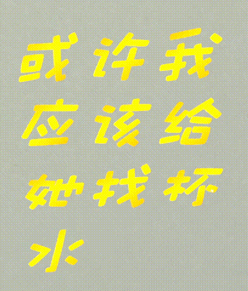
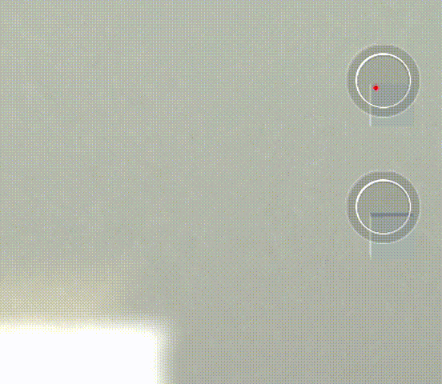

## **Ordinary Day 开发日志**

### **〇.【准备工作】**

#### **(2).【目标】**

- 查找相关文档，熟悉 Unity 软件、改进引擎
- 参考游戏*[《What Remains of Edith Finch》](https://store.steampowered.com/app/501300/What_Remains_of_Edith_Finch/)*实现文字展示特效并参与叙事
- *完成一部流程完整的小体量叙事冒险游戏

#### **(3).【主要工作】**

- 资料查找、文档阅读

  > 引擎指导文档（约70%）

- 引擎源码阅读、改进

  > bug相当多！！！
  > 用熟了一些~~老bug~~ Feature，添加了一些新功能，创造了一些新bug

- 贴图制作、模型搭建、场景搭建（基本完成）

- 简单动画制作、脚本逻辑编写（基本完成）

  > 物体移动动画-开关门（**fin.**）
  > 物体移动动画-开关抽屉 （**fin.**）
  > 条件逻辑判定-道具使用（**fin.**）
  > 条件逻辑判定-前置任务（**fin.**）
  > 文字特效-波动（**fin.**）
  > 文字特效-打字机淡入淡出（**fin.**）
  > 文字特效-随机扭曲淡出
  > 语音字幕（**fin.**）
  > 机位控制（**fin.**）

- 叙事文本创作、语音制作（剧本流程完成大约20%）

- 音效、音乐演出（To be continued...）
  
- 开始动画、结束动画（To be continued...）

  > 睁眼动画，心脏鼓点
  > 开门，发光隧道

- \*UI美术设计（To be continued... ）

### **一：【物体移动动画】**

对模型建立相应碰撞箱 `Door_Colider`

添加物体模型 `3D_Models/xxx`

添加交互按钮 `Icon` 并链接

设置起点与终点对应旋转角/平移坐标

### **二：【条件逻辑判定】**

简单0/1逻辑脚本`Mybool.cs`：

```cpp
public class MyBool : MonoBehaviour{
    private bool m_Enable = false;
    public void Enable() { m_Enable = true; }
    public void Disable() { m_Enable = false; }
    public bool ask() { return m_Enable; }
}
```

开启某项活动时，前置条件判定脚本 `Conditions To Access The Puzzle` 链接调用 `ask` 函数。

完成某项活动时，后置钩子脚本 `Actions When Puzzel Is Solved` 链接调用 `Enable` 函数或 `Disable` 函数。

### **三：【文字特效】**

#### **1.【波动】**

以时间、横坐标为参数调用 $\mathrm{sin}$ 函数对纵坐标进行偏移，以达到纵向波动的效果。

`TMP_Dancing.cs` 脚本：

```cpp
void Update(){
    _textComponent.ForceMeshUpdate();
    var textInfo = _textComponent.textInfo;
    var charInfo0 = textInfo.characterInfo[0];
    var verts0 = textInfo.meshInfo[charInfo0.materialReferenceIndex].vertices;
    var origx0 = start_text_orig[charInfo0.vertexIndex + 0].x;//记录最左边的横坐标
    for (int i = 0; i < textInfo.characterCount; ++i){//访问每个文字
        var charInfo = textInfo.characterInfo[i];
        if (!charInfo.isVisible) continue;//若不显示，则跳过

        var verts = textInfo.meshInfo[charInfo.materialReferenceIndex].vertices;
        for (int j = 0; j < 4; ++j){//访问四个顶点
            var st = start_text_orig[charInfo.vertexIndex + j];
            verts[charInfo.vertexIndex + j] = new Vector3(st.x, st.y + Mathf.Sin((Time.time - _start_dancing_time) * 1f + (st.x - origx0) * 3.1415926f / 2.0f) * 0.025f, st.z);//坐标偏移
        }
    }
    //写入新信息
    for (int i = 0; i < textInfo.meshInfo.Length; ++i){
        var meshInfo = textInfo.meshInfo[i];
        meshInfo.mesh.vertices = meshInfo.vertices;
        _textComponent.UpdateGeometry(meshInfo.mesh, i);
    }
}
```

波动效果演示：


#### **2.【打字机淡入淡出】**

以时间为参数，不断将新的字符加入待处理队列

以时间为参数，计算透明度

`TMP_Typewriter.cs` 脚本：

```cpp
//【打字机淡入】
private IEnumerator OutputCharactersFading(){
    State = TypewriterState.Outputting;
    // 确保字符处于可见状态
    var textInfo = _textComponent.textInfo;
    _textComponent.maxVisibleCharacters = textInfo.characterCount;
    _textComponent.ForceMeshUpdate();
    // 没有字符时，直接结束输出
    if (textInfo.characterCount == 0){
        State = TypewriterState.Completed;
        OnOutputEnd(false);
        yield break;
    }
    // 先将所有字符设置到透明状态
    for (int i = 0; i < textInfo.characterCount; i++){
        SetCharacterAlpha(i, 0);
    }
    // 按时间逐渐显示字符
    var timer = 0f;
    var interval = 1.0f / OutputSpeed;//每个字符的淡入时间
    var headCharacterIndex = 0;
    while (State == TypewriterState.Outputting){
        timer += Time.deltaTime;
        // 计算字符顶点颜色透明度
        var isFadeCompleted = true;
        var tailIndex = headCharacterIndex - FadeRange + 1;//最多同时处理FadeRange个字的淡入
        for (int i = headCharacterIndex; i > -1 && i >= tailIndex; i--){
            var charInfo = textInfo.characterInfo[i];
            // 不处理不可见字符，否则可能导致某些位置的字符闪烁
            if (!charInfo.isVisible) continue;
            var step = headCharacterIndex - i;
            var alpha = (byte)Mathf.Clamp((timer / interval + step) / FadeRange * 255, 0, 255);

            isFadeCompleted &= alpha == 255;//该字符淡入完成
            SetCharacterAlpha(i, alpha);
        }
        _textComponent.UpdateVertexData(TMP_VertexDataUpdateFlags.Colors32);

        // 检查是否完成字符输出
        if (timer >= interval){
            if (headCharacterIndex < textInfo.characterCount - 1){
                timer = 0; headCharacterIndex++;
            }
            else if (isFadeCompleted){//所有字符淡入完成
                State = TypewriterState.Completed;
                OnOutputEnd(false);
                yield break;
            }
        }
        yield return null;
    }
}
```

淡出则透明度反相

`TMP_Typewriter.cs` 脚本：

```cpp
var alpha = (byte)Mathf.Clamp(255-(timer / interval + step) / FadeRange * 255, 0, 255);
isFadeCompleted &= alpha == 0;
```

打字机淡入淡出效果演示：


#### **3.【打字机波动淡入】**

将上面两者结合，并添加 `update` 函数，在淡入结束后调用，实现持续波动。

`TMP_Typewriter.cs` 脚本：
```cpp
void Update(){
    if (Is_Final_In==1&&State == TypewriterState.Completed && started == true && cleared == false){//如果在输出结束时的状态，继续波动
        ...
    }
}
//【打字机波动淡入】
private IEnumerator OutputCharactersFading_Final(){
    ...
}
```

打字机波动淡入效果演示：


#### **4.【随机扭曲淡出】**

记录初始状态坐标 $st$，计算末尾状态坐标 $ed$（在 $st$ 的基础上进行平移、旋转、缩小）

根据 $P(t)=(1-t)\times st+ed$ 进行变换，其中 $t$ 为时间。
  >原本是打算用`ARAP形状插值`算法的，但文本网格的获取较麻烦，所以没有实现。

同时计算透明度，结合添加淡出效果。

```cpp
private Vector3 calc_rotate(float P_x,float P_y,float A_x,float A_y,float theta){//点A绕点P逆时针旋转theta
    float x1 = A_x - P_x, y1 = A_y - P_y;
    float x2 = x1 * (float)Math.Cos(theta) - y1 * (float)Math.Sin(theta);
    float y2 = x1 * (float)Math.Sin(theta) + y1 * (float)Math.Cos(theta);
    return new Vector3(P_x + x2, P_y + y2, 0);
}
public Boolean ClearOutput(){//清除图像前置准备
    ...

    _textComponent = GetComponent<TMP_Text>();
    var textInfo = _textComponent.textInfo;
    clear_text_centry = new Vector3[textInfo.characterCount];//末尾状态中心
    clear_text_orig = new Vector3[textInfo.characterCount * 4];//初始状态坐标（当下状态）
    clear_text_end = new Vector3[textInfo.characterCount * 4];//末尾状态坐标

    for (int i = 0; i < textInfo.characterCount; ++i) {
        var charInfo = textInfo.characterInfo[i];
        if (!charInfo.isVisible) continue;//若不显示，则跳过

        var verts = textInfo.meshInfo[charInfo.materialReferenceIndex].vertices;
        var index0 = charInfo.vertexIndex;

        float add_x = Mathf.Sin(i * 3.1415926f / 2.0f) * 0.025f;//平移偏移量
        float add_y = Mathf.Sin(i * 3.1415926f / 2.0f) * 0.025f;
        for (int j = 0; j < 4; ++j)
            clear_text_orig[index0 + j] =
            new Vector3(verts[index0 + j].x, verts[index0 + j].y, verts[index0 + j].z);//记录初始位置（当下状态）
        clear_text_centry[i] = new Vector3(//平移后的中心
            (verts[index0 + 0].x + verts[index0 + 1].x + verts[index0 + 2].x + verts[index0 + 3].x) / 4 + add_x,
            (verts[index0 + 0].y + verts[index0 + 1].y + verts[index0 + 2].y + verts[index0 + 3].y) / 4 + add_y,
            (verts[index0 + 0].z + verts[index0 + 1].z + verts[index0 + 2].z + verts[index0 + 3].z) / 4);
        for (int j = 0; j < 4; ++j){
            Vector3 tmp=calc_rotate(clear_text_centry[i].x, clear_text_centry[i].y, clear_text_orig[index0 + j].x + add_x, clear_text_orig[index0 + j].y + add_y, Mathf.Sin(i + 1) * 3.1415926f/2f);

            float k = 0.7f;//缩小为原来的多少倍
            clear_text_end[index0 + j] = new Vector3(clear_text_centry[i].x + k * (tmp.x - clear_text_centry[i].x), clear_text_centry[i].y + k * (tmp.y - clear_text_centry[i].y),0);
        }
    }
    ...
}
//【随机扭曲淡出】
private IEnumerator ClearCharactersRandom_together(){
    ...
    headCharacterIndex=textInfo.characterCount - 1;
    while (State == TypewriterState.Outputting){
        ...
        tailIndex = 0;
        for (int i = headCharacterIndex; i > -1 && i >= tailIndex; i--){
            var charInfo = textInfo.characterInfo[i];
            // 不处理不可见字符，否则可能导致某些位置的字符闪烁
            if (!charInfo.isVisible) continue;
            var step = headCharacterIndex - i;
            var alpha = (byte)Mathf.Clamp(255-(timer / Together_time) * 255, 0, 255);
            var rate = (byte)Mathf.Clamp(timer / Together_time * 255, 0, 255);
            //var rate = (byte)Mathf.Clamp( (Mathf.Exp(timer)-1) / (Mathf.Exp(Together_time) - 1) * 255, 0, 255);
            var verts = textInfo.meshInfo[charInfo.materialReferenceIndex].vertices;
            var index0 = charInfo.vertexIndex;
            for (int j = 0; j < 4; ++j){//访问四个顶点
                var st = clear_text_orig[index0 + j];
                var ed = clear_text_end[index0 + j];
                verts[index0 + j] = (1 - (float)rate / 255) * st + (float)rate / 255 * ed;//坐标偏移
            }
            isFadeCompleted &= rate >= 255;
            isFadeCompleted &= alpha == 0;
            SetCharacterAlpha(i, alpha);
        }
        ...
    }
}
```

随机扭曲淡出效果演示：


#### **5.【其他】**

$UI$ 界面设置淡入淡出速度、几种特效可选、添加重复播放功能。

```cpp
[Tooltip("字符输出速度（字数/秒）。")]
[Range(1, 255)]
[SerializeField]
private byte _outputSpeed = 5;

[Tooltip("字符淡化范围（字数）。")]
[Range(0, 50)]
[SerializeField]
private byte _fadeRange = 10;

[Tooltip("是否启用打字机波动淡入？")]
[Range(0, 1)]
[SerializeField]
private byte _is_final_in = 1;

[Tooltip("是否启用随机扭曲淡出？")]
[Range(0, 1)]
[SerializeField]
private byte _is_together = 1;

[Tooltip("随机扭曲淡出时间（秒）")]
[Range(1, 10)]
[SerializeField]
private byte _together_time = 2;

public bool only_one_time = true;//是否只允许播放/消除一次
```

### **四：【台本创作和语音制作】**

VITS参数：`noise_scale=0.1;` `noise_scale_w=0.9;` `length_scale=1.2;`

[[开发日志]台本](./[开发日志]台本.md)

### **六：【剧情流程控制】**

睁眼（To be continued...）

盆栽提示（可选）、拾取清水杯，浇水\*3，找到日记-药（**fin.**）

查看海边的画\*2，抽屉提示（自动）、打开抽屉找到日记-海（**fin.**）

书（爱好话题，日记本\*1）（To be continued...）

抱枕、电视遥控器、电视机（日常生活话题，日记本\*1）（To be continued...）

洗发水、浴室梳子（梳头发话题，日记本\*1）（To be continued...）

拾取咖啡、甜甜圈、厨房灶（做饭话题，日记本\*1）（To be continued...）

时钟，结束游戏（日期，日记本\*1）（To be continued...）

### **五.【资源与参考】**

#### (1).参考资料

- [Unity 实现各种动态文字特效 (基于TextMeshPro)](https://www.bilibili.com/video/av760720199)
- [Unity文字效果（描边，发光，投影等](https://www.bilibili.com/video/av869719366/?spm_id_from=333.337.search-card.all.click&vd_source=a636ec0af1839807602c33477005de83)
- [【Unity】带有字符淡入效果的TextMeshPro打字机效果组件](https://blog.csdn.net/qq_21397217/article/details/119155513)
- **To be continued...**

#### **(2).使用软件**

- Unity 2022.3.0f1
- Adobe Photoshop 2023
- Autodesk MAYA 2022
- [VITS语音合成](https://www.bilibili.com/video/av656172945) （[Voistock Mode(402 epochs)-沢城みゆき](https://github.com/CjangCjengh/TTSModels)）
- **To be continued...**

#### **(3).素材资源**

- 【基础引擎】：[First person narrative adventures + complete puzzle engine](https://assetstore.unity.com/packages/templates/systems/first-person-narrative-adventures-complete-puzzle-engine-131623) —— Unity Asset Store
- 【基础场景模型】[Japanese Apartment](https://assetstore.unity.com/packages/3d/environments/japanese-apartment-126497#description) —— Unity Asset Store
- 【配乐】[bgm1-冬の情景にて——こっけ](https://dova-s.jp/bgm/play8506.html)
- 【音效】[sound1-水バッシャ_2——稿屋 隆](https://dova-s.jp/se/play1230.html)
- **To be continued...**

### **六.【后记】**

- 完成度太低  
1.课业太头疼了……没多少时间。只能交一个阉割再阉割的半成品。
2.实际上做不完也是因为野心太大，直到今早凌晨2点还在冒新点子出来。内容越做越多完成度反而越来越低。
3.暑假会再肝一肝，端一个更完整的出来再传github。

- 个人收获  
1.极大锻炼了读~~屎山~~的能力、英文说明文档阅读能力。
2.工程管理的重要性（并不限于团队！独立个人也需要！）
3.相比之前学maya时，对许多名词概念有了了解，引擎理解、软件上手要轻松得多。

- 感谢陈仁杰老师、吴川助教、吴中昊助教一学期的教学指导。